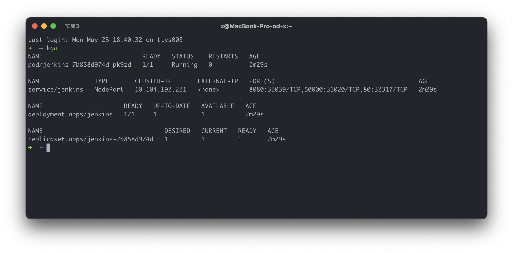
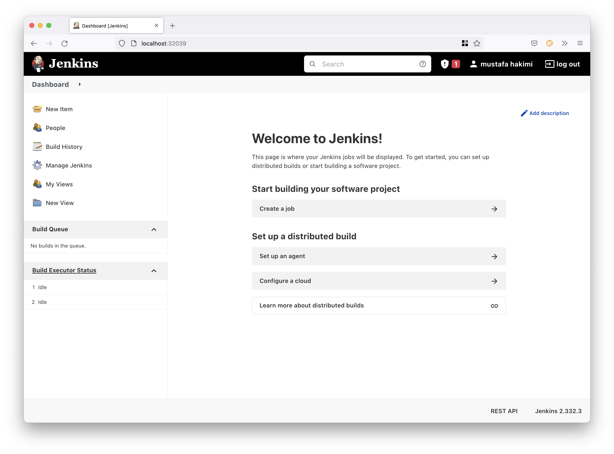
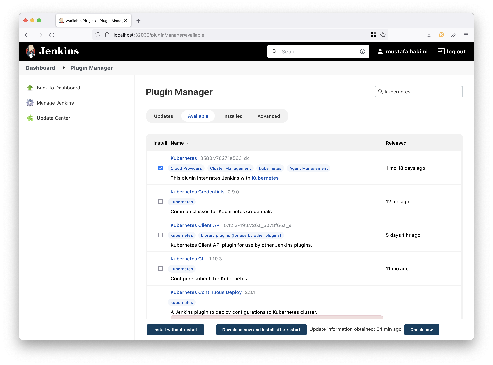
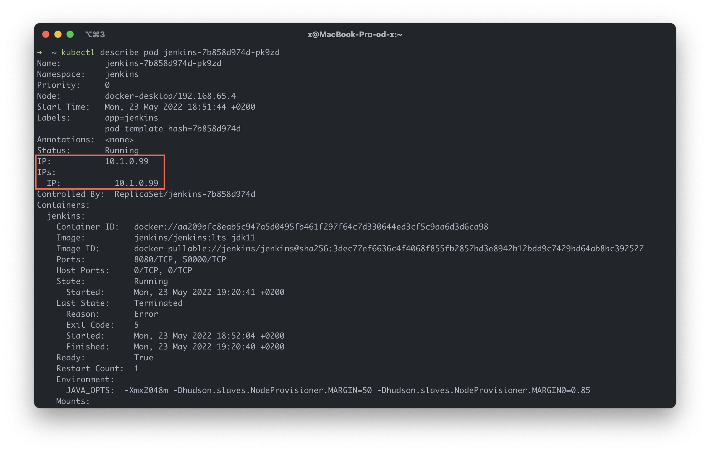
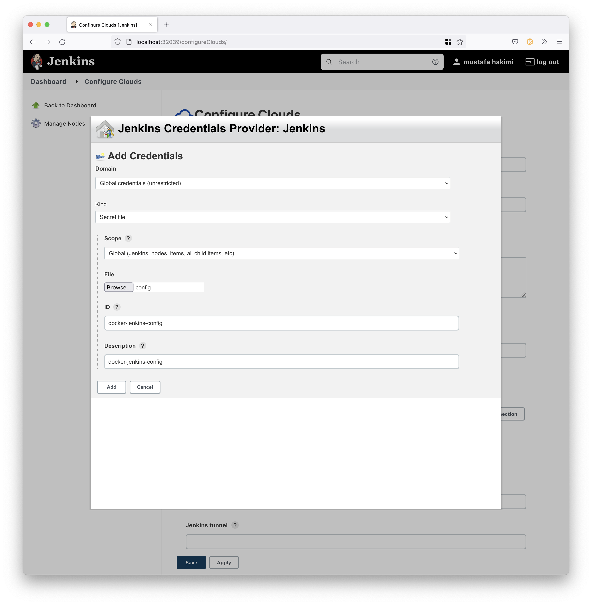
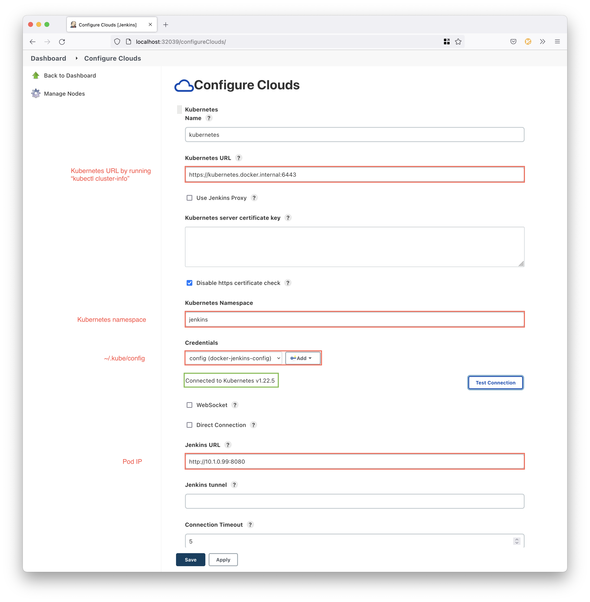
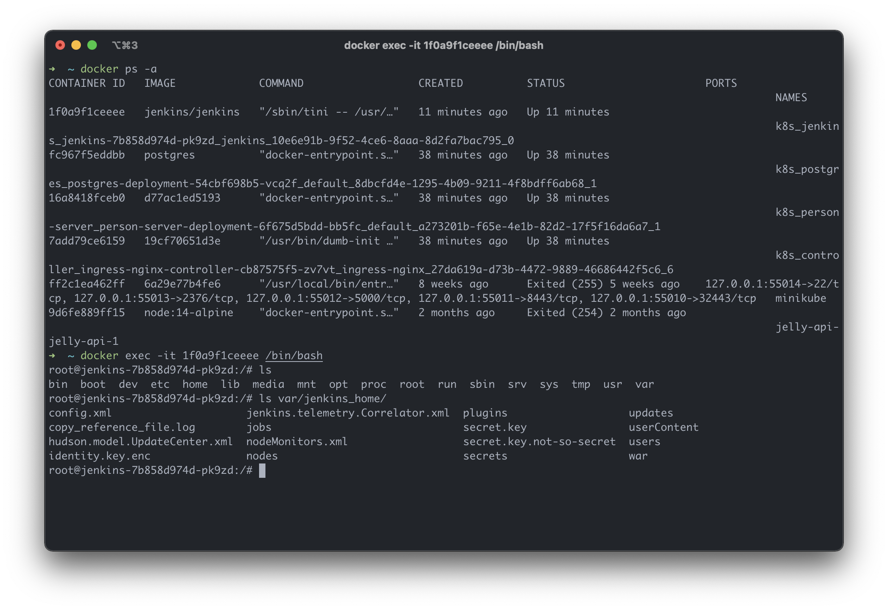

# Jenkins on Kubernetes using Docker Desktop

_Works on Apple Silicon_

* [Setup](#setup)
* [Deploy Kubernetes Manifests](#deploy-kubernetes-manifests)
* [Configure Jenkins](#configure-jenkins)
* [Configure Cloud](#configure-cloud)
* [Data Persistence](#data-persistence)

### Setup 

1. Create a Docker context 
```shell
docker context create docker-jenkins \
  --default-stack-orchestrator=kubernetes \
  --kubernetes config-file=/Users/x/.kube/config \
  --docker host=unix:///var/run/docker.sock

> 'Successfully created context "docker-jenkins"'
```
> Make sure that `/Users/x/.kube/config` exists

2. Change to the new context 
```shell
docker context use docker-jenkins
```

3. Export the Kubernetes context
```shell
docker context export docker-jenkins --kubeconfig

> 'Written file "docker-jenkins.kubeconfig"'
```

4. Copy the content of `docker-jenkins.kubeconfig` and add it to 
the `~/.kube/config` file. 


### Deploy Kubernetes Manifests 

1. Create a Kubernetes namespace 
```shell
kubectl create namespace jenkins

> 'namespace/jenkins created'
```

2. Use the new namespace
```shell
kubens jenkins

> 'Active namespace is "jenkins"'
```

3. Apply the Kubernetes manifests 
```shell
kubectl apply -f ./kubernetes

> 'deployment.apps/jenkins created'
> 'persistentvolume/jenkins created'
> 'persistentvolumeclaim/jenkins-claim created'
> 'serviceaccount/jenkins created'
> 'clusterrole.rbac.authorization.k8s.io/jenkins created'
> 'rolebinding.rbac.authorization.k8s.io/jenkins created'
> 'service/jenkins created'
```



### Configure Jenkins

Jenkins is accessible at:
```shell
http://localhost:<service-port>
```
Get the service port: 
```shell
kubectl get service

NAME      TYPE       CLUSTER-IP       EXTERNAL-IP   PORT(S)                                       AGE
jenkins   NodePort   10.104.192.221   <none>        8080:32039/TCP,50000:31020/TCP,80:32317/TCP   18m
```
Navigate to:
```shell
http://localhost:32039
```
> The initial Jenkins admin user password is outputted in the pod logs. <br>
> It may also be found at: /var/jenkins_home/secrets/initialAdminPassword




### Configure Cloud 

Install the [Kubernetes Plugin](https://plugins.jenkins.io/kubernetes/) and restart Jenkins. 
The running docker container (jenkins/jenkins) will automatically exit and restart. 


1. Get cluster info 
```shell
kubectl cluster-info

> 'Kubernetes control plane is running at https://kubernetes.docker.internal:6443'
> 'CoreDNS is running at https://kubernetes.docker.internal:6443/api/v1/namespaces/kube-system/services/kube-dns:dns/proxy' 
```
2. Get the Jenkins IP from the pod:
```shell
kubectl describe pod <pod-name> 
```


Jenkins is running on `http://10.1.0.99:8080` inside the cluster. The pod IP is used to configure 
clouds (kubernetes connectivity) on Jenkins.

1. Navigate to Configure Clouds on Jenkins and add the `~/.kube/config` as a credential (secret file)



2. Configure Cloud 




### Data Persistence 

The Jenkins data is stored using a _PersistenceVolume_ (PV), which is a piece of storage in the cluster that 
has been provisioned using a storage class. It is a resource in the cluster just like a node is a cluster
resource. A _PersistenceVolumeClaim_ (PVC) is used to consume the PV resources. Claims can request a specific 
size and access modes (e.g., they can be mounted ReadWriteOnce, ReadOnlyMany or ReadWriteManny).

The Jenkins data is accessible inside the Docker container - in the `/var/jenkins_home` directory. 


